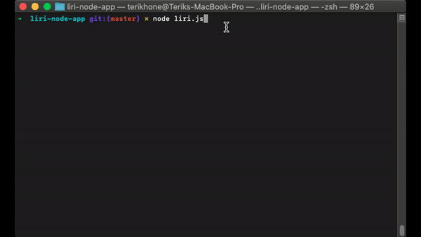
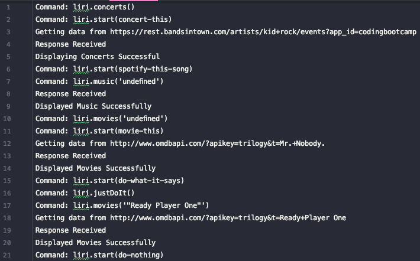

# Node Liri Bot

LIRI is a _Language_ Interpretation and Recognition Interface. LIRI is a command line node app that takes in parameters and gives you back data. Some of the things you can do with the liri bot is...
* Search for Concerts by band or artists
* Search for information on a song
* Search for information on a movie

## Demo

#### Log file

## Installation

Navigate to the folder where you want to clone the app then run the following command.
` git clone git@github.com:torqie/liri-node-app.git`

This command will create a folder called liri-node-app and the project file will be within that folder. Lets go ahead and change into that directory now
` cd liri-node-app `

Next we need to install the npm dependencies. Run the following command in the terminal.
` npm install `

Great! That is all that is require for installation  for this node app.

## How To Use

Now that you have the node app installed lets go ahead and run the app with the following command
` node liri.js `

From here select one of the following
* Show me contcert information *(Finds concerts by band or artist)*
* Look up song information *(Finds information about a song)*
* Look up information on a movie *(Finds information about a movie)*
* Show me something random *(Reads a text file and does what it says)*
* Nothing, I'm done having fun *(Exits The Program)*

If you select any of the options besides the "Nothing, I'm done having fun" option on the next propmp you will be 
asked for the item you are searching for. Please note that if you dont have an idea of what to search for, we have 
provided some great defaults.

## Technologies Used
* Javascript
* Axios
* Moment
* Node

## Conculsion

I hope that you enjoy my node app as much as I enjoyed making it.